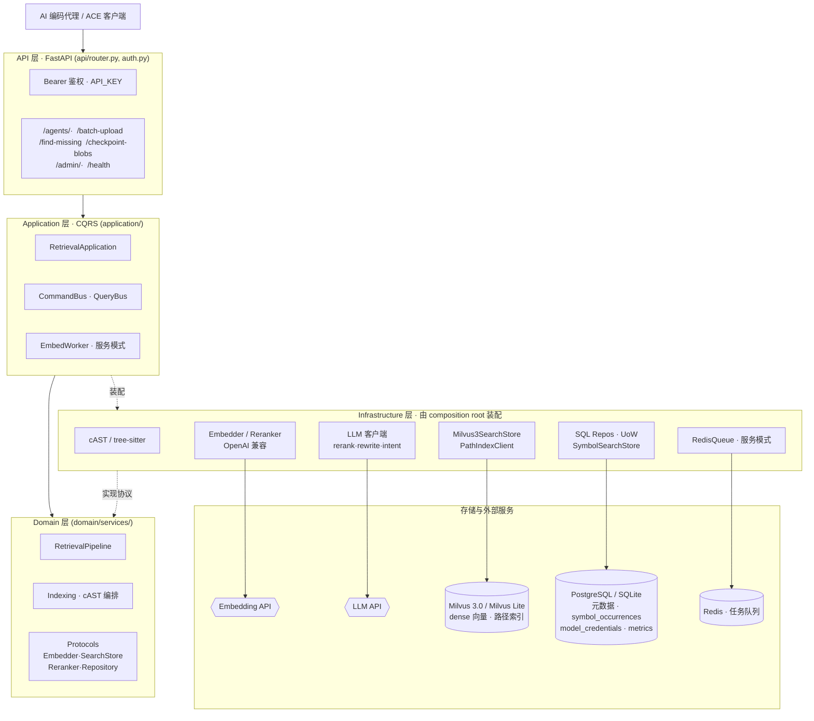
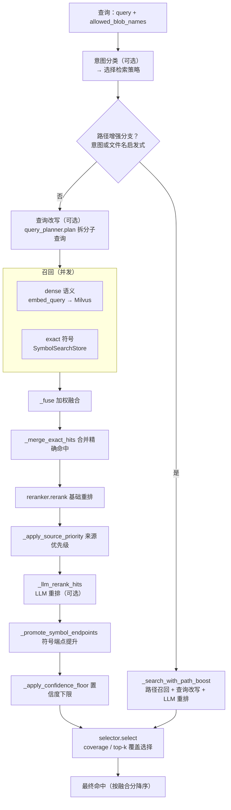

<div align="center">


# OpenContextEngine

**自托管、ACE 兼容的代码检索服务，为 AI 编码代理提供精准上下文。**

dense + exact + path 混合召回 · cAST 语义切块 · LLM 重排 · 覆盖度感知选择

[English](README.md) · [简体中文](README.zh-CN.md)

[](https://github.com/oce-ai/oce/actions/workflows/ci.yml)
[](https://pypi.org/project/opencontextengine/)
[](https://pypi.org/project/opencontextengine/)
[](LICENSE)
[](https://github.com/oce-ai/oce/pkgs/container/oce)
[](https://fastapi.tiangolo.com/)
[](https://milvus.io/)
[](#api)

</div>

OpenContextEngine 是一个自托管、ACE 兼容的代码检索服务。它用 cAST 语义切块索引源码，
把元数据存入 PostgreSQL 或 SQLite，在 Milvus 3.0 中做 dense 向量检索，并在覆盖度感知的
最终选择之前用 LLM 对结果重排。

它提供两种部署模式：零依赖的**个人模式**（SQLite + 内嵌 Milvus Lite，后台 worker 关闭），
面向单机；以及**服务模式**（PostgreSQL + Milvus 3.0 + Redis），面向共享、更高吞吐的部署。

项目完全开源，服务端和客户端分别维护：

- 服务端：<https://github.com/oce-ai/oce>
- 客户端：<https://github.com/oce-ai/oce-client>

这是此前 ACE 服务的重构版本，相关背景和早期实现见
[linux.do 讨论](https://linux.do/t/topic/2308140/125)。

如果你只想在本机给 AI 编码工具提供代码上下文，直接使用个人模式即可；如果需要让多台
机器或多个用户共享同一套索引，再部署服务模式并配合 `opencontextengine-client`。

## 特性

- **混合检索** —— 并发的 dense 语义召回（Milvus 3.0）、exact 精确标识符查找（`symbol_occurrences`）与独立路径索引，用加权 rank fusion 融合。
- **cAST 语义切块** —— 基于 tree-sitter 沿语义边界切分源码，而非机械的行窗口。
- **LLM 重排 + 覆盖度感知选择** —— 基础重排、可选 LLM 重排，再用贪心 bin-packing 优先保证仓库覆盖度、抑制重叠片段、限制每路径 chunk 数，并遵守硬字符预算。
- **两种部署模式** —— 零依赖个人模式（SQLite + 内嵌 Milvus Lite）面向单机；服务模式（PostgreSQL + Milvus 3.0 + Redis）面向共享与更高吞吐。
- **ACE 兼容 API** —— 面向 ACE 客户端的 `/agents/*` 接口，Bearer 鉴权保护。
- **清晰的 DDD/CQRS 架构** —— 依赖向内收敛；infrastructure 只由 composition root 装配，业务逻辑保持可测。
- **运维 admin API + 监控** —— 独立 admin key 的接口面管理模型凭据、嵌入队列与垃圾回收；旁路 metrics 管线记录调用/token/资源指标与检索各阶段审计。
- **[可复现的评测框架](https://github.com/oce-ai/oce-benchmark)** —— 纯 HTTP 的基准套件，用 Top-1 + nDCG@10 在真实仓库上衡量检索质量。

<details>
<summary><strong>目录</strong></summary>

- [特性](#特性)
- [环境要求](#环境要求)
- [个人模式](#个人模式)
- [服务模式](#服务模式)
- [客户端与 MCP](#客户端与-mcp)
- [API](#api)
- [架构](#架构)
  - [检索管线](#检索管线)
- [测试](#测试)
- [许可](#许可)

</details>

## 环境要求

- Python 3.11 及以上
- [uv](https://docs.astral.sh/uv/)

个人模式无需其它依赖：元数据落在 SQLite，向量落在内嵌的 Milvus Lite 文件。服务模式额外
需要 PostgreSQL 16、Milvus 3.0 和 Redis；其开发用编排见 `docker-compose.dev.yml`。

## 个人模式

个人模式适合本机使用，不需要单独部署 PostgreSQL、Milvus 或 Redis。安装 CLI、生成配置、
填好嵌入 key，然后启动：

```powershell
uv tool install opencontextengine
oce init                    # 生成 ~/.oce/data/.env
```

编辑 `~/.oce/data/.env`。嵌入服务是建库和检索所需的唯一必填项；默认配置使用 SiliconFlow
和 Qwen3-Embedding-4B（输出 1024 维向量）：

```dotenv
EMBED_API_KEY=你的嵌入服务密钥
# 以下两项已有默认值，只有更换供应商或模型时才需要修改
EMBED_ENDPOINT=https://api.siliconflow.cn/v1/embeddings
EMBED_MODEL=Qwen/Qwen3-Embedding-4B
```

推荐再配置一个 OpenAI 兼容的轻量 LLM，用于意图识别和语义精排。模型名和 endpoint 请以
你使用的供应商为准，例如 `qwen3.7-flash`；追求速度时也可以选择供应商提供的更快模型：

```dotenv
LLM_API_KEY=你的 LLM 服务密钥
LLM_BASE_URL=https://provider.example.com/v1
LLM_MODEL=qwen3.7-flash
RERANK_ENABLED=false
```

如果暂时不配置 LLM，请同时关闭 LLM 重排和意图分类：

```dotenv
LLM_RERANK_ENABLED=false
RETRIEVAL_INTENT_CLASSIFICATION_ENABLED=false
```

然后启动服务：

```powershell
oce serve                   # http://127.0.0.1:8986
```

个人模式默认只监听 `127.0.0.1`，并预填客户端约定的 `API_KEY=sk-opencontextengine`。如果
要监听局域网或公网地址，请改用强随机 `API_KEY`，并在客户端同步设置 `OCE_API_KEY`。

`oce serve` 启动时会自动执行数据库迁移（Alembic），然后准备好 SQLite、内嵌 Milvus Lite
文件和一个关闭的后台 worker，因此 `oce init` 只暴露你真正要填的少量 key。生成的 `.env`
放在 data 目录，每次启动自动加载。常用参数：

- `--data-dir <path>` —— 数据库、向量文件和 `.env` 的存放位置（默认 `~/.oce/data`）
- `--env-file <path>` —— 改为加载指定的 `.env`（优先级最高）
- `--port <n>` / `--host <addr>` —— 监听地址（默认 `127.0.0.1:8986`）

`oce version`（或 `oce --version`）打印当前版本；`oce -v serve` 把日志级别提到 INFO，
`-vv` 提到 DEBUG（默认 WARNING，让检索管线的 info 日志保持安静）。

想临时试跑而不安装：`uvx --from opencontextengine oce serve`。

## 服务模式

服务模式面向多人或多台机器共享索引，由 PostgreSQL、Milvus 3.0 和 Redis 支撑。推荐使用
仓库自带的 Docker Compose：

```powershell
git clone https://github.com/oce-ai/oce.git
Set-Location oce
Copy-Item .env.example .env
# 编辑 .env：至少设置 API_KEY、ADMIN_API_KEY、EMBED_API_KEY；按需设置 LLM_API_KEY
docker compose up -d
```

根目录的 `docker-compose.yml` 会一起启动 OCE、PostgreSQL、Redis 和 Milvus 依赖，应用容器
启动时自动执行迁移。服务模式务必把 `API_KEY` 和 `ADMIN_API_KEY` 换成强随机值，并在 `.env`
中设置 Compose 使用的 `POSTGRES_PASSWORD`、`REDIS_PASSWORD`；不要把真实密钥提交到仓库。
开发环境若只想启动依赖、在宿主机运行应用，可使用 `docker-compose.dev.yml`，但要先把
`.env` 中的 `DB_URL`、`REDIS_URL` 改为该文件映射到宿主机的端口，再执行
`uv run alembic upgrade head` 和 `uv run uvicorn`。

也可以直接使用已经发布的镜像：

```powershell
docker pull ghcr.io/oce-ai/oce:latest
```

在自己的 Compose、Kubernetes 或其它编排文件中，将应用服务镜像设为
`ghcr.io/oce-ai/oce:latest`，并提供下面三个服务连接配置：`DB_URL`、`REDIS_URL` 和
`MILVUS_ENDPOINT`。镜像入口默认监听容器内的 `8986` 端口。

### Rust 实现

Rust 移植版（`rust/`）同样实现服务模式，且依赖更轻：仅需 PostgreSQL（元数据 +
可选 pgvector 向量）与 Redis——不需要 etcd/MinIO/Milvus 容器。使用仓库根目录的
`docker-compose.service.yml`，或查阅 [`rust/README.md`](rust/README.md) 了解完整
后端矩阵（`VECTOR_BACKEND=trivium|pgvector`）。Rust 服务保持与 Python 版一致的
ACE API 面、schema（与 alembic head 逐列兼容）和 Redis 队列语义（Lua 去重、
处理队列恢复）。

Rust 版独有的检索增强（oce-benchmark 200 题实测，Qwen3-Embedding-8B，
无 LLM/重排档）：

- **pgvector 词法混合路**（`PGVECTOR_LEXICAL`）：tsvector + ts_rank 与 dense
  检索 RRF 融合——比纯 dense +2.8~3.3 分，追平 TriviumDB 的 BM25 混合且无其
  引擎级 AC 前缀噪声
- **查询嵌入缓存**：重复查询直接命中向量缓存（~400ms API 往返 → ~9ms）
- **意图分类器驼峰符号锚点**：多词驼峰标识符（`RequestContext`）与
  缩写+语境词（`XHR 三种调用`）正确判为符号/调用链查询——标识符密集仓 +3.7 分
- **PG 元数据批量写**（UNNEST）与并发 ingest：PostgreSQL 后端 stage-1 索引
  提速约 35%

### Admin 管理面板

服务启动后可使用官方在线面板：<https://oce-ai.github.io/oce-admin>。

1. 在服务端设置独立的 `ADMIN_API_KEY`（不设置时会回落到 `API_KEY`）。
2. 在面板中填写服务地址和 admin key。
3. 通过面板管理模型凭据、队列、垃圾回收和监控指标。

admin key 只保存在浏览器本地存储中，不要写入 URL、仓库或日志。自定义面板域名时，用
`CORS_ORIGINS` 配置允许的来源。

模型客户端从单张 `model_credentials` 表按 `kind`（`embed`、`rerank`、`llm_rerank`、
`query_rewrite`、`intent`）解析凭据：取 status=active 中 `priority` 数字最小的一行。某个
kind 没有匹配的启用行时，对应客户端回退到各自的环境变量（`EMBED_*`、`RERANK_*`、`LLM_*`；
重排还会复用嵌入 key）。通过 `/admin/credentials` API 管理这些行，再调
`POST /admin/credentials/reload` 即可在不重启服务的情况下热重载所有客户端。

SiliconFlow 单次嵌入请求的 `input` 数组最多接受 32,000 字符。`max_batch_size` 和
`max_batch_chars` 是每个凭据可覆盖的 provider 默认值。超过 `max_input_chars` 的输入会在
文本边界带重叠地切分、分别嵌入，再按长度加权、池化并归一化成一个 chunk 向量。这种模型
特定的分段不会改变领域层的 chunk 边界。

包含多个明确句子或列表项的仓库级请求，会被分解成一个完整查询加若干有界 facet 查询。每个
查询独立召回候选；结果用加权 rank fusion（`RETRIEVAL_RRF_K` 可调）融合后再重排。单查询
模式用 `RETRIEVAL_DEFAULT_TOP_K`，多查询模式每个查询用 `RETRIEVAL_PER_QUERY_TOP_K` 控制
候选池大小。最终选择采用贪心 bin-packing 策略，优先保证仓库覆盖度（两遍：先确保每个文件
都有代表，再用剩余预算补齐），抑制文件内重叠片段，限制每个路径的 chunk 数，并遵守硬字符
预算。设 `RETRIEVAL_QUERY_DECOMPOSITION_ENABLED=false` 可关闭分解，回到经典单查询 Top-K。

上传准入会在切块前拒绝依赖/构建/缓存目录、含 NUL 的文件，以及 SVG、媒体、压缩包、压缩
打包产物、source map、lock 文件等非源码产物。被跳过的路径会作为空的 ready blob 持久化，
避免客户端反复重传。项目清单和测试固件有显式豁免。

## 客户端与 MCP

客户端负责扫描本地工作区、上传变更、维护 checkpoint，并调用服务端检索当前代码。它是
独立发布的包，详见 <https://github.com/oce-ai/oce-client>：

```powershell
uv tool install opencontextengine-client

$env:OCE_API_URL = "http://127.0.0.1:8986"
$env:OCE_API_KEY = "sk-opencontextengine"  # 服务模式请改为服务端 API_KEY
$env:OCE_WORKSPACE = (Get-Location).Path

oce-client sync
oce-client retrieve "Where is request authentication implemented?"
```

需要接入支持 MCP 的 AI 编码工具时，安装 MCP extra 并启动 stdio server：

```powershell
uv tool install "opencontextengine-client[mcp]"
oce-client-mcp --workspace C:\path\to\workspace
```

`oce-client-mcp` 会在后台建立初始索引、监听工作区变化，并把 `codebase-retrieval` 暴露为
MCP 工具。多个工作区可重复传入 `--workspace`；此时工具调用必须指定对应的
`workspace_folder`。API 地址、密钥和工作区也可以通过 `OCE_API_URL`、`OCE_API_KEY`、
`OCE_WORKSPACE`/`OCE_WORKSPACES` 配置。请将密钥放在环境变量或 secret manager 中，不要写进
MCP 配置文件。

## API

鉴权分三档：

- **公开**（无需鉴权）—— `GET /health`、`GET /version`
- **数据面** —— `Authorization: Bearer <API_KEY>`
- **Admin**（`/admin/*`）—— `Authorization: Bearer <ADMIN_API_KEY>`；未配置 `ADMIN_API_KEY` 时回落到 `API_KEY`

后端默认已放行官方 `oce-admin` 面板 `https://oce-ai.github.io`，直接使用公共面板时无需额外配置。
若面板部署在自定义域名或私有地址，用 `CORS_ORIGINS` 覆盖（多个来源用逗号分隔）；设
`CORS_ORIGINS=`（留空）可关闭浏览器跨域调用。admin key 仅保存在面板浏览器的本地存储中，不要写入仓库或 URL。

### 数据面端点

| 方法 | 路径 | 用途 |
| --- | --- | --- |
| `POST` | `/find-missing` | 分类未知和未索引的 blob 哈希 |
| `POST` | `/batch-upload` | 切块、嵌入并索引源码 blob |
| `POST` | `/agents/codebase-retrieval` | 返回格式化的代码上下文 |
| `POST` | `/agents/blob-status` | 校对 blob 与 checkpoint 状态 |
| `POST` | `/checkpoint-blobs` | 创建或推进工作集 checkpoint |

### Admin 端点

| 方法 | 路径 | 用途 |
| --- | --- | --- |
| `GET` | `/admin/credentials` | 列出模型凭据（密钥已脱敏） |
| `POST` | `/admin/credentials` | 创建凭据 |
| `PATCH` | `/admin/credentials/{id}` | 更新凭据 |
| `DELETE` | `/admin/credentials/{id}` | 删除凭据 |
| `POST` | `/admin/credentials/{id}/duplicate` | 用新 key 复制一份凭据 |
| `POST` | `/admin/credentials/reload` | 热重载启用中的凭据 |
| `GET` | `/admin/queue` | 嵌入队列深度与在飞数 |
| `POST` | `/admin/queue/reset` | 清空或重置嵌入队列 |
| `POST` | `/admin/queue/requeue-stale` | 重新入队滞留的在飞 blob |
| `POST` | `/admin/gc` | 回收过期的 chain 与 blob |
| `GET` | `/admin/stats` | 调用 / token / 检索 / 资源指标 |

示例：

```powershell
$headers = @{ Authorization = "Bearer $env:API_KEY" }
$body = @{
  information_request = "Where is request authentication implemented?"
  # 全库检索已禁用：必须声明工作集（有效的 checkpoint_id 或非空 added_blobs）。
  # added_blobs 是 batch-upload 返回的 blob_name（sha256 内容地址），此处为示例占位。
  blobs = @{ checkpoint_id = ""; added_blobs = @("<blob-name-from-batch-upload>"); deleted_blobs = @() }
} | ConvertTo-Json -Depth 4
Invoke-RestMethod http://127.0.0.1:8986/agents/codebase-retrieval `
  -Method Post -Headers $headers -ContentType application/json -Body $body
```

## 架构

依赖方向向内收敛（`shared <- domain <- application <- api`）。`infrastructure` 实现
domain/shared 协议，且只能由 composition root（`application/container.py`）装配；router
不编排业务流程。



应用层负责用例编排和事务边界。FastAPI 只校验传输 DTO、执行鉴权和错误映射。PostgreSQL
（个人模式下为 SQLite）存 blob/chunk/checkpoint 元数据和标识符出现位置；Milvus 存 dense
向量和路径索引。

### 检索管线

`RetrievalPipeline.search`（`domain/services/retrieval.py`）按意图分阶段执行：可选的意图
分类与查询改写、并发的 dense + exact 召回、加权 rank fusion、基础重排与可选的 LLM 重排，
最后做覆盖度感知的选择。



## 测试

按文件独立运行，让 Milvus Lite 和 tree-sitter 运行时在进程间释放：

```powershell
uv run pytest tests/unit/application/test_service.py -q
uv run pytest tests/unit/domain/test_retrieval.py -q
uv run pytest tests/unit/infrastructure/test_milvus3.py -q
```

在内存受限的开发机上，不要在一个进程里运行整个 `tests/unit/infrastructure` 目录。

## 许可

Apache-2.0。OpenContextEngine 与 Augment Code Inc. 相互独立。
